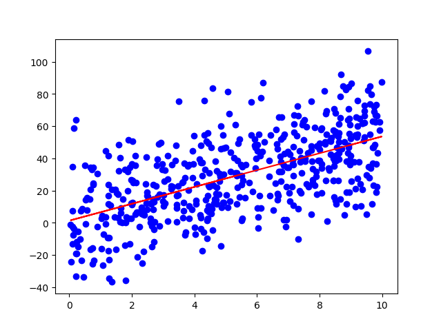
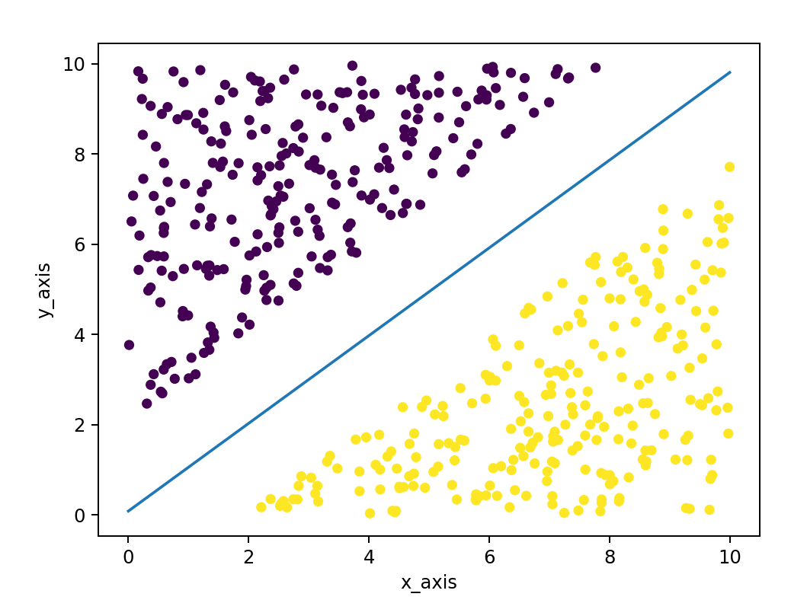
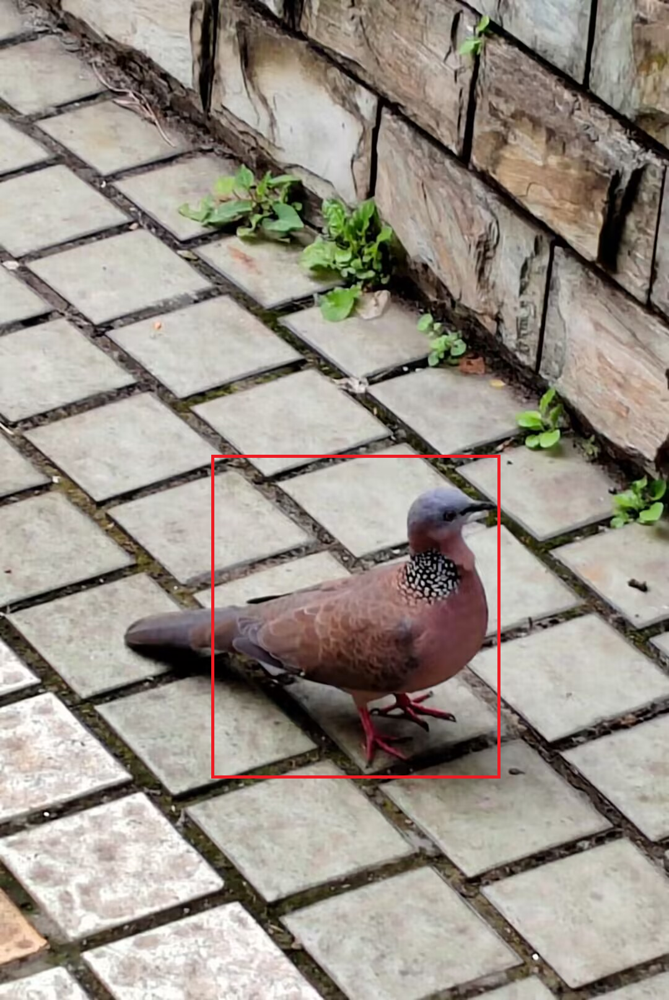

# 机器学习招新题

> 科学领域最好由它所研究的中心问题来界定。机器学习领域试图回答以下问题：
> “我们怎样才能建立一个随着经验而自动改进的计算机系统，而支配所有学习过程的基本法则是什么？

**引言(what? how? and why?)**

所以什么是机器学习?我想大致如下**:“机器学习是让计算机像人类一样学习和行动的科学，通过以观察和现实世界互动的形式向他们提供数据和信息，以==自主==的方式改善它们的学习。”**那么机器学习的专家们又如何让这个和人们下意识主关思维不同的想法变为可能呢?大概是从线性,逻辑回归到SVM算法再到重换新生的深度学习,我想通过下面的这些题目,你将有所了解.最后的最后就是why?这大概源于一个个灵感迸发吧.想想看你所接触这么久的数学,物理等等等等,或多或少都具有些许宗教性,些许可知论,但机器学习的学者们,便早早跳出这个思维,我们试着创造不同的机器,使其具备自主改善它们的学习,==我们创造自己的“宗教”,我们让机器自我可知==.

## 1做不完的热身题😤

出题人：陈津旭

QQ：3121571886（欢迎讨论与交流）

### 1.1写在前面✒️

很高兴在这里见到你,欢迎你来到机器学习的世界🙉! “==做不完==”的热身题? 别紧张,或许它会是最轻松的一道题.热身题,顾名思义其目的是为了让大家更快的了解机器学习是什么,怎么学,并为下面的题目打下基础.我们会在下面提供相关的学习资料，当然也希望你可以善于使用==搜索引擎==，自己动手丰衣足食.

所以,开始热热身吧,希望这道题可以伴随你的学习生涯,成为一道做不完的题目😁🎉.

### 1.2题目

  1.学会编写markdown格式的文件,==注意此后大部分题目题目均需提交为Markdown格式==.

  2.阅读但==不限于==我们所给出的资料,==尽可能多的==了解机器学习的相关概念(可以参照后续题目进行关键词搜索)，并编写markdown格式的文件记录你的学习笔记.如:

- 机器学习发展史?
- 机器学习算法有哪些分类?(监督学习，无监督学习，强化学习都是什么?)
- 机器学习的流程?
- gpt到底是什么???
- …(还有更多等你补充捏😋)


## 1.3相关资料💡

1. [机器学习发展历史回顾 - 知乎 (zhihu.com)](https://zhuanlan.zhihu.com/p/43833351)

2. [(强推|双字)2022吴恩达机器学习Deeplearning.ai课程_哔哩哔哩_bilibili](https://www.bilibili.com/video/BV1Pa411X76s/?spm_id_from=333.337.search-card.all.click&vd_source=9996fc4a466cb25c78a24664ce4381e5)

3. 周志华《机器学习》[链接](https://link.zhihu.com/?target=https%3A//pan.baidu.com/s/1oTJjTkxK0PuV2nRExq1wcA) 提取码:odp0

4. 推荐一个知乎博主==‘化简可得’==,他的文章都很通俗易懂(线性回归,逻辑回归,svm…都有涵盖),况且他的文章在csdn要开会员(😾狠狠白嫖😾)

   [(2 条消息) 化简可得 - 知乎 (zhihu.com)](https://www.zhihu.com/people/huajiankede)

5. 一个用简单的话语描述机器学习部分数学理论知识的up，svm，梯度下降，正则化都有讲捏[王木头学科学的个人空间_哔哩哔哩_bilibili](https://space.bilibili.com/504715181?spm_id_from=333.337.0.0)


## 2python基础

出题人：曹新

QQ：2738824383（欢迎提问和交流）

### 2.1引入

Python是一种面向对象的解释型计算机程序设计语言，具有丰富和强大的库。随着互联网的迅猛发展，Python也被看做是人工智能时代最佳的编程语言。Python提供大量机器学习的代码库和框架，在数学运算方面有NumPy，结构化数据操作可以通过Pandas，针对各种垂直领域比如图像、语音、文本在预处理阶段都有成熟的库可以调用。

### 2.2题目

#### 2.2.1 基础要求

1. 安装python相关编程环境（不推荐廖雪峰博客上的环境配置）

2. 掌握python基础语法，廖雪峰的个人网站学到函数式编程之前（即高级特性学完）

3. 女人的秘密

   年龄是女人最大的秘密，直男小y在和他的crush玩猜年龄小游戏，每次猜完一次年龄如果输入的年龄错误的话，可以再次输入，最多只能输入三次，大于三次的话还是可以拥有机会（提问是否继续），输入字母Y或者y的话就是继续猜年龄，输入N或者n的话就退出本次循环，当你输入字符不是Y或者N的话，会提示：请输入正确字符！

4. 采用递归和非递归两种方式实现将所输入的5个字符，以相反顺序打印出来。

   > 提示：非递归利用字符串的切片方法

5. 敏感的纪念日

   一月一日是小y和他女朋友在一起的纪念日，为了不忘记买纪念礼物，请帮他做一个程序：输入某月某日，判断这一天是他们在一起的第几天?

   > 提示：要考虑是不是闰年在一起的哦

### 2.3 相关资料

---

#### 2.3.1 学习资料

1. pyhton之父之中国分父 廖雪峰 的个人网站（简单易懂，快速上手）

   [Python教程 - 廖雪峰的官方网站 (liaoxuefeng.com)](https://www.liaoxuefeng.com/wiki/1016959663602400)

2. 菜鸟教程

   [Python 基础教程 | 菜鸟教程 (runoob.com)](https://www.runoob.com/python/python-tutorial.html)

3. 马士兵 Python基础版2020年全新教程

   [Python 入门基础版|基础语法](https://www.bilibili.com/video/BV1wD4y1o7AS/?spm_id_from=333.337.search-card.all.click&vd_source=d4c17aa371e79e6e6536727d550cb72b)

> 遇到理解不了的可以在CSDN、知乎、博客园上查询，有能力可以去提前掌握翻墙技巧

---


## 3线性回归

出题人：邓皓文   
QQ：2207976948

### 3.1 什么是线性回归

什么是**线性**，什么是**回归**？**线性回归**的作用是什么？将你的理解写在markdown学习笔记中。

### 3.2 初识线性回归

机器学习是不断发展的数据科学领域的重要组成部分。在机器学习的发展过程中，计算机的大规模运算具有不可或缺的作用。所以，**熟练运用代码**进行拟合回归是极为重要的。

#### 3.2.1 小试牛刀

使用python，自行创建一组数据集，尝试调用sklearn库中的线性回归模型进行训练，并调用matplotlib库输出。结果类似于下图：



### 3.3 理论理解

现在的第三方库已经提供了多样化的工具来直接实现线性回归，但是**自己理解**这个过程是也非常重要的。

#### 3.3.1 基础学习

自行推导一遍梯度下降法进行线性回归的过程，理解各个参数是如何变化的。使用python，自主编写线性回归的代码，并将其中的参数的关系以可视化的形式展现出来，如迭代次数n与损失函数的关系，不同学习率α对损失函数有什么影响（至少三种关系）。

#### 3.3.2 进阶学习

怎么对多变量的数据集进行线性回归？学习基本的线性代数知识，使用最小二乘法自行编写算法，调用sklearn库中的波士顿房价数据集，将一部分数据进行训练，另一部分数据进行测试，输出拟合图像结果。（若代码编写有困难，可以直接调用库函数，但是要理解其中原理）

### 3.4 思考题（选做）

假如多变量中的某些变量线性相关，运用最小二乘法求解会发生什么？岭回归的作用是什么？它相比于普通线性回归解决了什么问题？Lasso和岭回归的区别是什么？将你的理解写在markdown学习笔记中。


## 4逻辑回归

出题人:陈津旭

QQ:3121571886(欢迎讨论与交流)

### 4.0万事开头难✒️

   相信你看到这里时已经完成了线性回归的绝大部分习题🎉🎉🎉,一行行的数学公式,奇形怪状的符号,可能让你头痛欲裂.不如我们先缓解缓解压力,静下心来做一个小小的思考与回顾:

   回顾: 在线性回归里面你学到了哪些概念呢?线性回归究竟用来解决什么问题呢?

   思考:  什么是逻辑回归呢?逻辑回归为什么产生呢?再往下想想线性回归和逻辑回归有什么联系呢?它们本质上有区别吗?

注意:==回顾==部分无硬性要求,但==思考==部分请你编写markdown记录你的==学习历程==及==做题时的遇到的问题==.

### 4.1正式引入

#### 4.1.1工欲善其事,必先利其器

相信你在完成之前题目时已经或多或少的安装了matplotlib、sklearn等python库,接下来你还要安装==numpy、pandas==这两个库并学习其基本用法(==针对题目去专项学习==即可),为后续的数据处理、图像绘制、模型导入做准备.

### 4.2动手试试实现二分类吧🌌 .

#### 4.2.1小试牛刀

题目要求:

   使用我们给出的数据,==调库==进行逻辑回归分类，输出==拟合效果最佳==的直线的==斜率k和截距b==，并画出包含决策边界与数据的散点图,大致如下(当然也可以画出具有自己风格的图像)(注意所给数据拥有分类,记得用不同颜色将其区分):



tips:我们所给出的数据有玄机哦……

#### 4.2.2代码填空

题目要求:

   首先==熟悉逻辑回归的数学推导==,并尝试自己动手看看是否真正理解其思路.(或许你会对压根没听过的数学概念感到头疼,但不必担心,==重点理解其思路即可==),可以参考资料中的第一个知乎文章.

   其次完成下列代码填空,实现手动的逻辑回归(当然如果你有信心也可以自己编写代码,不必完成填空)(==共十个==)

   ==注意使用上一题中我们所给的数据即可==.

:

```python
#代码中theta为权重,b为截距,eta为学习率
#导入所需的库

# 读取数据,使用上一题中我们所给的数据即可
train_data = __(1)
# 坐标
feature = __(2)
# 类别
label = __(3)

# 定义逻辑函数
def sigmoid(x):
    return _______(4)


# 定义逻辑回归训练模型
def fit(x, y, eta= ____):   (5)      # eta为学习率
    n_iters = ____          (6)      #n_iters为训练次数
    theta1 = 1.0  # 随机生成一个theta1
    theta2 = -1.0  # 随机生成一个theta2
    b = 0.0 
    for i in range(n_iters):
        #预测逻辑函数,即计算Y_hat
        (7)
        # 计算权重,截距的偏导,并最后输出
        (8)
    return [theta1, theta2, b]


# 用逻辑回归模型拟合构造的数据集
theta = fit(feature, label)

#定义决策边界的计算
def decision(x):
    return _______(9)

# 计算决策边界,并完成可视化,画出数据散点图与决策边界
_____(10)

```

### 4.3相关资料及数据💡

#### 4.3.1数据

链接: https://pan.baidu.com/s/12YF31ecJjVkdB5YeqWztIw?pwd=r4wy 提取码: r4wy 复制这段内容后打开百度网盘手机App，操作更方便哦

#### 4.3.2资料

1. [用人话讲明白逻辑回归Logistic regression - 知乎 (zhihu.com)](https://zhuanlan.zhihu.com/p/139122386)
2. [(强推|双字)2022吴恩达机器学习Deeplearning.ai课程_哔哩哔哩_bilibili](https://www.bilibili.com/video/BV1Pa411X76s/?spm_id_from=333.337.search-card.all.click&vd_source=9996fc4a466cb25c78a24664ce4381e5)


## 5. Damn！mushroom~🍄

> **出题人：刘富临**
>
> **QQ：3061114306(欢迎经过思考后的提问)**

### 5.1 引入🚦：

从1956年夏季首次提出“人工智能”这一术语开始，科学家们尝试了各种方法来实现它。如专家系统，决策树、归纳逻辑、聚类等等，但这些都是假智能。直到人工神经网络技术的出现，才让机器拥有了“真智能”。

### 5.2 基础题✨

1.初步了解神经网络工作的基本原理

2.学习梯度下降算法用并完成所给数据用梯度下降法寻找 **0.3\*(x+y)^2^-x\*y+1**的极小值

3.运行结果要求打印类似如下的图


### 5.3 进阶要求🔥

1.对所给蘑菇数据进行**预处理**(数据缺失**30%**以上可以删去该特征，其余可选择用**众数**填补)

2.不调用库函数，手动搭建一个**没有隐藏层**的神经网络

3.在完成以上两题的基础上手动搭建一个拥有一层隐藏层的浅层神经网络，要求隐藏层的神经元为**十个**

4.要求在markdown上写出**详细的特征工程**(遇到的问题以及怎么解决的也可以写在上面)

**数据处理后搭建神经网络的格式：**

```python
def sigmoid(x):
    
    
    return

def deriv_sigmoid(x):

    
    return 

def initial_parameters (in_, hidden_, out_):
    """
    in_ : 输入层神经元个数
    hidden_:隐藏层神经元个数
    out_: 输出层神经元个数
    w1: 隐藏层权重参数weights_1
    w2: 输出层权重参数weights_2
    b1: 隐藏层偏置参数bias_1
    b2: 输出层偏置参数bias_2
    设计思路:w,b的规模应当满足前向传播计算中矩阵乘法的计算要求
    """
    parameters = {
        'w1':
        'w2':
        'b1':
        'b2':
    }
    return parameters  # 该函数返回初始化好的权重参数字典

# 本函数为前向传播
def feed_forward(parameters, X):
    """
    parameters: 参数字典,即初始化的权重参数
    X: 输入值
    y_pred: 预测值
    设计思路:利用参数字典中的w,b和输入值X，先进性线性变换，再进行激活，完成前向传播。将得到的y_pred添加保存至参数字典中。
    """
  

    return parameters  # 该函数返回通过前向传播求出的y_pred字典

# 本函数为反向传播求梯度
# 通过链式法则求出梯度
def gradient(parameters, X, y):
    """
    parameters: 参数字典
    X: 输入数据
    y: 输入数据
    dw: 权重参数的梯度
    db: 偏置参数的梯度
    设计思路:通过链式法则，得到w,b对损失函数的偏导数，得出dw,db。
    """
    
    
    return grad  # 该函数返回通过反向传播求出的梯度字典

# 本函数通过梯度下降更新参数
def update(grad, parameters, lr):
    """
    grad: 通过反向传播求出的梯度,保存了当前的dw,db
    parameters: 参数字典,保存了当前的w,b
    lr: 学习率,影响梯度下降的速度
    """
    
    
    return parameters

#接下来是调用以上函数并用自己处理好的数据画出损失函数所计算的值随更新次数下降的趋势图
```

**📌ps：这里以有隐藏层为例，搭建无隐藏层时函数initial_parameters里只有in_ ,out_ 两个参数,而在initial_parameters返回的字典里也没有w2和b2。**

​	 **格式中已给出要求激活函数用sigmoid，损失函数用交叉熵损失函数**

#### 5.3.1 Tips🎗️

- 在分析特征时，**删去与毒性无关的特征**，并**合并某一特征中对有无毒性作用基本相似的特征类型**。(比如手机是否流畅中的不同品牌这一特征，苹果和三星都不流畅，但华为流畅，则可将苹果三星合并为一个品牌，则就只剩苹果三星，华为两个特征类型了)

- 删去特征和合并特征类型时判断依据是**画出柱状图**并分析，可只用分析

​		’cap_color‘，’gill_attachment‘，’gill_color’，‘has_ring’，‘habitat’，‘season’这几个特征，并选分别选则删去一个特征和合并一个特征中的某两个类型

### 5.4 相关学习资料📚

1.B站上吴恩达老师机器学习课程https://www.bilibili.com/video/BV164411b7dx?p=51

2.知乎和CSDN等网站上搜索关键字如：梯度下降算法 反向传播算法 手动搭建浅层神经网络

3.神经网络具体计算原理推荐看https://zhuanlan.zhihu.com/p/96046514

3.周志华《机器学习》[链接](https://link.zhihu.com/?target=https%3A//pan.baidu.com/s/1oTJjTkxK0PuV2nRExq1wcA) 提取码:odp0

### 5.5 数据📃

链接：https://pan.baidu.com/s/1v0oEPdBgOrX0DlEtukNn8Q?pwd=yfta
提取码：yfta


## 6&#x2753; 啥么是SVM(支持向量机)

出题人：陈文琦
联系方式(QQ): 1401137731

### 6.0前置知识

&#x1F4E3;在线性回归的题目之后，我们会发现遇到一些更复杂的问题时，需要一种更powerful的模型来解决。
&#x1F44D;在2012年 深度学习流行之前，最主流的机器学习方法其实是SVM 支持向量机，就算是现在学习机器学习，SVM也是很多课程和教材绕不过的内容。
&#x1F4CA;这一部分的题目学习可能会比较偏向数学，在简单地建立一点框架之后，若想要更进一步，就可能需要学习最优化理论相关的东西了。

### Dive into SVM

&#x1F332; 或许我们可以带着三个problems进入SVM的世界：

1. **Evaluation**: 我们要找的函数F(x,y)大概长什么样子
2. **Infenrence**：如何才能确定这个函数F(x,y)的参数就是所求的最优解
3. **Training**：如何利用给出的数据很好地进行训练/迭代

### *附赠* ♨️学习“饮料”：

1. &#x1F449; [Support Vector Machine PDF/李宏毅ML2016FALL](https://speech.ee.ntu.edu.tw/~tlkagk/courses/ML_2016/Lecture/SVM%20(v5).pdf)
2. &#x1F449; [Support Vector Machine Video/李宏毅ML2016FALL](https://www.youtube.com/watch?v=QSEPStBgwRQ)
3. &#x1F449;：周志华《机器学习》[链接](https://link.zhihu.com/?target=https%3A//pan.baidu.com/s/1oTJjTkxK0PuV2nRExq1wcA) 提取码:odp0
4. :metal:Highly Recommended：[SVM原理推导(数学推导) ](https://zhuanlan.zhihu.com/p/30971899)（数学的部分讲得很清楚）
5. :clap:Highly Recommended：[SVM原理推导(数学推导) ](https://www.bilibili.com/video/BV1mE411p7HE/?spm_id_from=333.337.search-card.all.click&vd_source=81015d40886a554d633a523ab9ec6db5)（逻辑清晰，时间不够可以和上面一个选挑着看）

6. &#x1F449;*(参考)*： [SVM bilibili 菜菜的机器学习sklearn](https://www.bilibili.com/video/BV1vJ41187hk?p=47&vd_source=81015d40886a554d633a523ab9ec6db5)
7. &#x1F449;*(参考)*： [李宏毅ML2016FALL](https://speech.ee.ntu.edu.tw/~hylee/ml/2016-fall.php)
8. &#x1F449;*(参考)*： [动手学深度学习 PyTorch版 bilibili](https://space.bilibili.com/1567748478/channel/seriesdetail?sid=358497)
9. &#x1F449;*(参考)*： [李宏毅ML2023FALL](https://speech.ee.ntu.edu.tw/~hylee/ml/2023-spring.php) 较为前沿的课程，可以了解一下

---

## &#x1F463;6.1在了解了这三个问题之后，我们可以开始着手解决题目了

### 📌Warm up

:memo: 把你在学习支持向量机过程中的一些笔记和思考记录下来，可以是文字，也可以是图片或截图（提交时请插入markdown文件中），只要能够清晰地表达你的想法就可以。这个过程可以帮助你更好地理解SVM的原理，也可以帮助你更好地完成后面的任务。

**题目要求**： 尽量使用markdown格式，如果不会的话可以参考[这里](https://www.jianshu.com/p/191d1e21f7ed)。

## 6.2📌Task1：线性可分的情况

### Task1.1

:hocho: 小试牛刀 ~ 

我们先从一个简单的二分类问题开始，稍稍了解一下各种框架和库的使用方法吧。

数据集[链接(这里)](https://pan.baidu.com/s/1PSM9WwJFJH5N06QvDvuzkg?pwd=lian)  提取码：lian

**题目要求**：文档中给出了一个简单二分类数据集，请对其进行处理，并利用SVM算法进行分类，可以自选深度学习代码框架（pytorch/tensorflow/keras），也可利用sklearn等库进行实现；当然学有余力的keen learner也可以自己手动实现SVM算法。

### Task1.2

:tanabata_tree: iris数据集是机器学习入门绕不开的经典（bushi打卡点。作为一个沾花惹草的人，你将扮演一个花匠的角色去总结花的特征，将其分为三类，分别是山鸢尾，变色鸢尾，维吉尼亚鸢尾，具体的数据集可以参考[链接(这里)](https://archive.ics.uci.edu/ml/datasets/iris)。当然你也可以直接使用sklearn中的iris数据集或者下载在[链接(这里)](https://pan.baidu.com/s/16rkfb79BlgypxgDVaZCfgA#list/path=%2F)提供的iris数据集文件(提取码：8eev)。

**题目要求**：在初窥SVM门路后，在二分类SVM算法的框架下，尝试对iris数据集进行分类，可以自选深度学习代码框架（pytorch/tensorflow/keras），也可利用sklearn等库进行实现。

## 6.3📌Task2：线性不可分的情况

:thought_balloon:==**思考题**==：不做硬性要求(选做)

1. 当一个任务不是线性可分的时候，神经网络是能够通过增加隐藏层来解决的；**那么SVM是如何做到呢？他们之间又有什么联系和不同呢?**（如果还不是那么了解神经网络/感知机的话，第二个问号可以暂不用回答）。

2. **通过VC维度 如何来理解SVM的损失函数?**
   *hint*: *经验风险/结构风险*

**题目要求**： 将回答写在你的Warm_up学习笔记中。

---

## 6.4提交方式

**SVM部分的题目提交为文件夹形式，包含以下内容：**

:incoming_envelope: Warm_up和Task2的提交格式合为同一个markdown文件
:incoming_envelope: Task1的两个任务则都需要提交可运行的python代码文件、分别的运行结果截图。当然，相信你在环境配置和代码修改过程中遇到了很多掉头发的问题吧，也可以把问题和解决方案附记录在一个markdown文件中，分享让痛苦减半~

> **==Tips==**：有关于题目不明白不清楚的地方，欢迎找出题人询问；不明就里的库函数、数学知识点等等，用好搜索引擎大概率能找到答案。如果还是不明白，可以在群里提问，或者在群里发起讨论，也可以在自己的学习笔记中记录下来，等待后面的学习; 当然，也欢迎找出题人进行讨论:smile:~~


# 附加题📚

## 7【猫猫和胖鸟】You only look once

​	在美丽的成电校园，有可爱的猫猫，还有一群讨厌的胖鸟，你骑着小黄车路过时它们也不理会你。可是有时候猫猫和胖鸟会藏在草丛里，你偶然路过的时候不能发现憨憨的它们。没有关系！钰涵姐姐会帮助你。（钰涵姐姐是链时代工作室的专属机器人，她只听你的话，所以你必须告诉她该如何判断噢。）                                

Q1:学习yolo算法，了解其基本结构和实现流程。

Q2:比较yolo算法各个版本的区别和新版本的优化。

Q3:运用yolov5实现猫猫和胖鸟的识别。效果demo如下：



