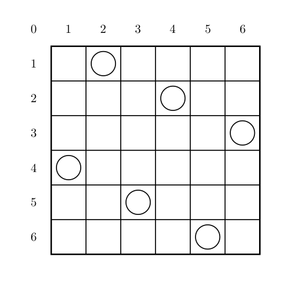

# 入门

# 1.A+B Problem

## 题目描述

输入两个整数 a, b，输出它们的和（|a|,|b| <= {10}^9）。

注意
 
1. Pascal 使用 `integer` 会爆掉哦！
2. 有负数哦！
3. C/C++ 的 main 函数必须是 `int` 类型，而且 C 最后要 `return 0`。

好吧，同志们，我们就从这一题开始，向着大牛的路进发。

> 任何一个伟大的思想，都有一个微不足道的开始。

## 输入格式

两个以空格分开的整数。

## 输出格式

一个整数。

## 样例 #1

### 样例输入 #1

```
20 30
```

### 样例输出 #1

```
50
```


# 2.三连击

## 题目背景

本题为提交答案题，您可以写程序或手算在本机上算出答案后，直接提交答案文本，也可提交答案生成程序。

## 题目描述

将 1, 2, ... , 9 共 9 个数分成 3 组，分别组成 3 个三位数，且使这 3 个三位数构成 1 : 2 : 3 的比例，试求出所有满足条件的 3 个三位数。

## 输入格式

无

## 输出格式

若干行，每行 3 个数字。按照每行第 1 个数字升序排列。

## 样例 #1

### 样例输入 #1

```
无
```

### 样例输出 #1

```
192 384 576
* * *
...

* * *
（剩余部分不予展示）
```


# 3.最大子段和

## 题目描述

给出一个长度为 n 的序列 a，选出其中连续且非空的一段使得这段和最大。

## 输入格式

第一行是一个整数，表示序列的长度 n。

第二行有 n 个整数，第 i 个整数表示序列的第 i 个数字 a_i。

## 输出格式

输出一行一个整数表示答案。

## 样例 #1

### 样例输入 #1

```
7
2 -4 3 -1 2 -4 3
```

### 样例输出 #1

```
4
```

# 中档

# 4.独木桥

## 题目背景

战争已经进入到紧要时间。你是运输小队长，正在率领运输部队向前线运送物资。运输任务像做题一样的无聊。你希望找些刺激，于是命令你的士兵们到前方的一座独木桥上欣赏风景，而你留在桥下欣赏士兵们。士兵们十分愤怒，因为这座独木桥十分狭窄，只能容纳 1个人通过。假如有 2 个人相向而行在桥上相遇，那么他们 2 个人将无法绕过对方，只能有 1 个人回头下桥，让另一个人先通过。但是，可以有多个人同时呆在同一个位置。

## 题目描述

突然，你收到从指挥部发来的信息，敌军的轰炸机正朝着你所在的独木桥飞来！为了安全，你的部队必须撤下独木桥。独木桥的长度为 L，士兵们只能呆在坐标为整数的地方。所有士兵的速度都为 1，但一个士兵某一时刻来到了坐标为 0 或 L+1 的位置，他就离开了独木桥。

每个士兵都有一个初始面对的方向，他们会以匀速朝着这个方向行走，中途不会自己改变方向。但是，如果两个士兵面对面相遇，他们无法彼此通过对方，于是就分别转身，继续行走。转身不需要任何的时间。

由于先前的愤怒，你已不能控制你的士兵。甚至，你连每个士兵初始面对的方向都不知道。因此，你想要知道你的部队最少需要多少时间就可能全部撤离独木桥。另外，总部也在安排阻拦敌人的进攻，因此你还需要知道你的部队最多需要多少时间才能全部撤离独木桥。

## 输入格式

第一行共一个整数 L，表示独木桥的长度。桥上的坐标为 1, 2, ..., L。

第二行共一个整数 N，表示初始时留在桥上的士兵数目。

第三行共有 N 个整数，分别表示每个士兵的初始坐标。

## 输出格式

共一行，输出 2 个整数，分别表示部队撤离独木桥的最小时间和最大时间。2 个整数由一个空格符分开。

## 样例 #1

### 样例输入 #1

```
4
2
1 3
```

### 样例输出 #1

```
2 4
```

## 提示

对于 100% 的数据，满足初始时，没有两个士兵同在一个坐标，1 <=  L <= 5 * 10^3，且数据保证 N<= L。


# 5.车厢重组

## 题目描述

在一个旧式的火车站旁边有一座桥，其桥面可以绕河中心的桥墩水平旋转。一个车站的职工发现桥的长度最多能容纳两节车厢，如果将桥旋转 $180$ 度，则可以把相邻两节车厢的位置交换，用这种方法可以重新排列车厢的顺序。于是他就负责用这座桥将进站的车厢按车厢号从小到大排列。他退休后，火车站决定将这一工作自动化，其中一项重要的工作是编一个程序，输入初始的车厢顺序，计算最少用多少步就能将车厢排序。

## 输入格式

共两行。  

第一行是车厢总数 $N( \le 10000)$。
  
第二行是 $N$ 个不同的数表示初始的车厢顺序。  
（**注**：实际上数据中并不都在同一行，有可能分行输入）

## 输出格式

一个整数，最少的旋转次数。

## 样例 #1

### 样例输入 #1

```
4
4 3 2 1
```

### 样例输出 #1

```
6
```


# 6.硬币翻转

## 题目描述

在桌面上有一排硬币，共 $N$ 枚，每一枚硬币均为正面朝上。现在要把所有的硬币翻转成反面朝上，规则是每次可翻转任意 $N-1$ 枚硬币（正面向上的被翻转为反面向上，反之亦然）。求一个最短的操作序列（将每次翻转 $N-1$ 枚硬币成为一次操作）。

## 输入格式

一个自然数 $N$（$N$ 为不大于 $100$ 的偶数）。

## 输出格式

第一行包含一个整数 $S$，表示最少需要的操作次数。

接下来的 $S$ 行每行分别表示每次操作后桌上硬币的状态（一行包含 $N$ 个整数 $0$ 或 $1$，表示每个硬币的状态，$0$ 表示正面向上，$1$ 表示反面向上。不允许输出多余空格。

对于有多种操作方案的情况，则只需**操作的字典序**最小输出一种。

操作的字典序是指，对于一次操作中的每个位置，$1$ 表示翻转，$0$ 表示不反转。

但是需要你输出的是每一次操作完的状态，$0$ 表示正面朝上，$1$ 表示反面朝上。

## 样例 #1

### 样例输入 #1

```
4
```

### 样例输出 #1

```
4
0111
1100
0001
1111
```

## 提示

有时候，反着思考某些条件，也是一种优秀的解题方法。


# 进阶

# 7.八皇后 Checker Challenge

## 题目描述

一个如下的 6 <= 6 的跳棋棋盘，有六个棋子被放置在棋盘上，使得每行、每列有且只有一个，每条对角线（包括两条主对角线的所有平行线）上至多有一个棋子。



上面的布局可以用序列 2 4 6 1 3 5 来描述，第 i 个数字表示在第 i 行的相应位置有一个棋子，如下：

行号 1 2 3 4 5 6

列号 2 4 6 1 3 5

这只是棋子放置的一个解。请编一个程序找出所有棋子放置的解。  
并把它们以上面的序列方法输出，解按字典顺序排列。  
请输出前 3 个解。最后一行是解的总个数。

## 输入格式

一行一个正整数 n，表示棋盘是 n * n 大小的。

## 输出格式

前三行为前三个解，每个解的两个数字之间用一个空格隔开。第四行只有一个数字，表示解的总数。

## 样例 #1

### 样例输入 #1

```
6
```

### 样例输出 #1

```
2 4 6 1 3 5
3 6 2 5 1 4
4 1 5 2 6 3
4
```

## 提示

【数据范围】  
对于 100% 的数据，6 <= n <= 13。

循环想必大家一定可以熟练掌握滴，试着暴力解出来吧。
试着从棋盘的两个对角线与坐标轴的关系的方向切入，说不定这道题就迎刃而解了呢。


# 8.最大公约数和最小公倍数问题

## 题目描述

输入两个正整数 x_0, y_0，求出满足下列条件的 P, Q 的个数：

1. P,Q 是正整数。

2. 要求 P, Q 以 x_0 为最大公约数，以 y_0 为最小公倍数。

试求：满足条件的所有可能的 P, Q 的个数。

## 输入格式

一行两个正整数 x_0, y_0。

## 输出格式

一行一个数，表示求出满足条件的 P, Q 的个数。

## 样例 #1

### 样例输入 #1

```
3 60
```

### 样例输出 #1

```
4
```

## 提示

P,Q 有 4 种：

1. 3, 60。
2. 15, 12。
3. 12, 15。
4. 60, 3。

对于 100% 的数据，2 <= x_0, y_0 <= {10}^5。

## 提示

众所周知，围绕最大公约数和最小公倍数有许许多多定理，尝试用这些数学定理解题吧。


# 9.彼岸花开七色天

## 题目描述

彼岸花开七色天，花开花落一千年


彼岸花，石蕊科，现在你看到了一片彼岸花海。

彼岸花的生长具有特殊规则：

最开始只有一朵彼岸花，编号为零，奇怪的是，第一天过后，这一朵彼岸花边长出了新的一朵编号为一的彼岸花，为了方便观察，我们定义一号彼岸花为零号彼岸花的“子花”。

以后每过一天，每一朵彼岸花边都会生长出新的彼岸花，如第二天零号彼岸花边生长出了二号彼岸花，一号彼岸花边生长出了三号彼岸花。

当然，为了方便计数，彼岸花的序号各不相同，而新的彼岸花生长是从零号彼岸花边开始，前一天的最后一个彼岸花边结束的。

如：

第一天 0-->1

第二天 0-->2,1-->3

第三天 0-->4,1-->5,2-->6,3-->7

等等

现在给你两朵彼岸花，请你求出最近公共祖先。


## 输入格式

t组数据，每组数据输入两个整数x,y.

## 输出格式

t行，每行输出第x朵花和第y朵花的最近公共祖先。

## 样例 #1

### 样例输入 #1

```
1
27238297641472
8086711413248
```

### 样例输出 #1

```
512
```

## 提示
此题目不限数据范围。

这些花朵是不是很像产生斐波纳基数列的那些兔子？试着从其中找到规律，并试着解决这个问题。
